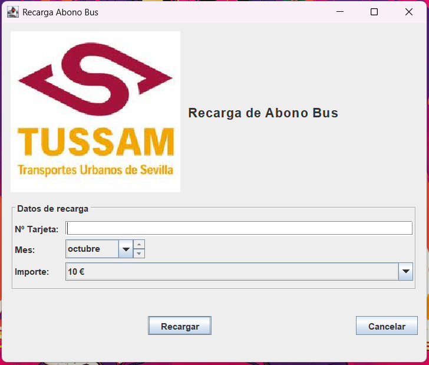

# 🚍 Recarga de Abono de Transporte — Módulo **Bus**

> 💡 Proyecto desarrollado en **IntelliJ IDEA** con **Maven** y la interfaz creada mediante **GUI Designer (Swing Form)**.  
> Este módulo forma parte del proyecto “Recarga de Abono de Transporte”, que incluye también un módulo paralelo de **Tren** (desarrollado por otro compañero).

---

## 🎯 **Descripción del ejercicio**

El objetivo de este módulo es diseñar una **interfaz gráfica funcional y amigable** para la **recarga del abono mensual de transporte BUS**, utilizando los componentes de **Java Swing** y el selector de mes **`JMonthChooser`** de la librería **JCalendar**.

El usuario puede:
- Introducir el número de su tarjeta 💳  
- Seleccionar el mes del abono 🗓️  
- Elegir el importe de la recarga 💰  
- Confirmar la operación con un clic ✨  

---

## 🎥 **Video de demostración**

Puedes ver el video completo del funcionamiento del programa aquí:  
👉 [Ver video en YouTube](https://www.youtube.com/watch?v=kEBTkxXAOrs)

O haz clic directamente en la imagen para abrirlo 👇

[](https://www.youtube.com/watch?v=ID_DEL_VIDEO)

> 🎬 En el video se muestra el proceso de introducción de datos, selección de mes e importe, validación de campos y mensaje final de confirmación mediante `JOptionPane`.

---

## 🧩 **Requisitos técnicos implementados**

| Requisito | Cumplido | Descripción |
|------------|:---------:|-------------|
| 🗓️ Uso de `JMonthChooser` | ✅ | Permite seleccionar el mes para recargar. |
| 🏷️ Etiquetas (`JLabel`) | ✅ | Indican los campos de tarjeta, mes e importe. |
| 🔘 Botones (`JButton`) | ✅ | “Recargar” y “Cancelar” con eventos asociados. |
| 💬 Cuadro de diálogo (`JOptionPane`) | ✅ | Confirma la recarga y muestra el mes seleccionado. |
| 🧮 Validación de campos | ✅ | Verifica que se haya introducido un número de tarjeta. |
| 💡 Tooltip | ✅ | Botón con ayuda contextual (“Recargar el abono seleccionado”). |
| 🔒 Confirmación al cerrar | ✅ | Ventana con aviso antes de salir. |
| 🖼️ Icono personalizado | ✅ | Icono de **bus** visible en la cabecera. |

---

## 🧠 **Funcionamiento**

1. El usuario introduce su número de tarjeta.
2. Selecciona el **mes** con el componente `JMonthChooser`.
3. Elige un importe de recarga desde el menú desplegable.
4. Pulsa **“Recargar”**.  
   → Aparece un `JOptionPane` confirmando la recarga, mostrando el **nombre del mes en español**.
5. Si intenta cerrar la ventana, el programa pedirá confirmación para salir.

---

## 🧱 **Estructura del proyecto**

```
RecargaAbonoBus/
├── pom.xml                           # Configuración Maven
├── README.md                         # Este archivo
└── src/
    └── main/
        ├── java/
        │   └── com/example/recarga/
        │       ├── RecargaAbonoBus.java   # Lógica principal y eventos
        │       └── RecargaAbonoBus.form   # Interfaz gráfica (GUI Designer)
        └── resources/
            └── icons/
                └── bus.png                # Icono del módulo Bus
```

---

## ⚙️ **Dependencias Maven**

Incluidas en el `pom.xml`:

```xml
<dependencies>
  <!-- Runtime para formularios creados con IntelliJ GUI Designer -->
  <dependency>
    <groupId>com.intellij</groupId>
    <artifactId>forms_rt</artifactId>
    <version>7.0.3</version>
  </dependency>

  <!-- Librería para el selector de mes (JMonthChooser) -->
  <dependency>
    <groupId>com.toedter</groupId>
    <artifactId>jcalendar</artifactId>
    <version>1.4</version>
  </dependency>
</dependencies>
```

---

## 🚀 **Cómo ejecutar**

1. Asegúrate de tener instalado:
   - ☕ **Java 8** o superior  
   - 🧰 **Maven 3.8+**
2. Abre el proyecto en **IntelliJ IDEA** (como proyecto Maven).
3. Ejecuta desde la terminal o desde IntelliJ:

```bash
mvn clean package
mvn exec:java -Dexec.mainClass=com.example.recarga.RecargaAbonoBus
```

---

## 🪄 **Características destacadas**

✨ **Diseño intuitivo:** interfaz clara, con márgenes equilibrados y disposición mediante `GridLayoutManager`.  
🧩 **Componentes Swing** usados correctamente (`JLabel`, `JButton`, `JTextField`, `JComboBox`, `JMonthChooser`).  
💬 **Interacción fluida:** validaciones y mensajes dinámicos.  
🔔 **Eventos de ventana (WindowListener):** confirmación antes de cerrar.  
🎨 **Iconografía personalizada:** `bus.png` como icono distintivo del módulo.  

---

## 🧠 **Ejemplo de flujo**

1️⃣ **El usuario abre la aplicación.**  
2️⃣ **Introduce su número de tarjeta** y selecciona el **mes de recarga**.  
3️⃣ Pulsa **“Recargar”** → aparece un cuadro de diálogo:  
> ✅ “Su abono de transporte ha sido recargado para el mes de: **Enero**.”  
4️⃣ El programa muestra el estado en pantalla y permite continuar o salir.

---

## 👨‍💻 **Autoría**

- 🧑‍💻 *Desarrollador del módulo Bus:* **[Alberto Alcalde Montero]**  
- 🚆 *Módulo Tren:* desarrollado por otro compañero (proyecto independiente).  
- 🧠 Proyecto realizado para la asignatura de **Desarrollo de interfaces**.  

---

## 🏁 **Estado del proyecto**

> ✅ Finalizado — módulo **Bus** totalmente funcional y validado.  
> 🚧 Módulo **Tren** en desarrollo por otro integrante del equipo.

---

## 📸 **Vista previa de la interfaz**

🪟 

---

## 💬 **Licencia**

Este proyecto se entrega con fines educativos.  
Libre para uso académico, modificación y aprendizaje. 🧩
